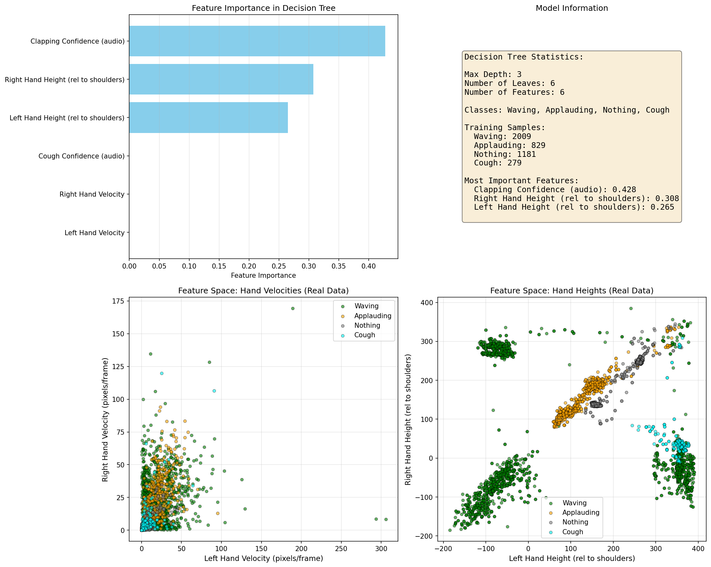
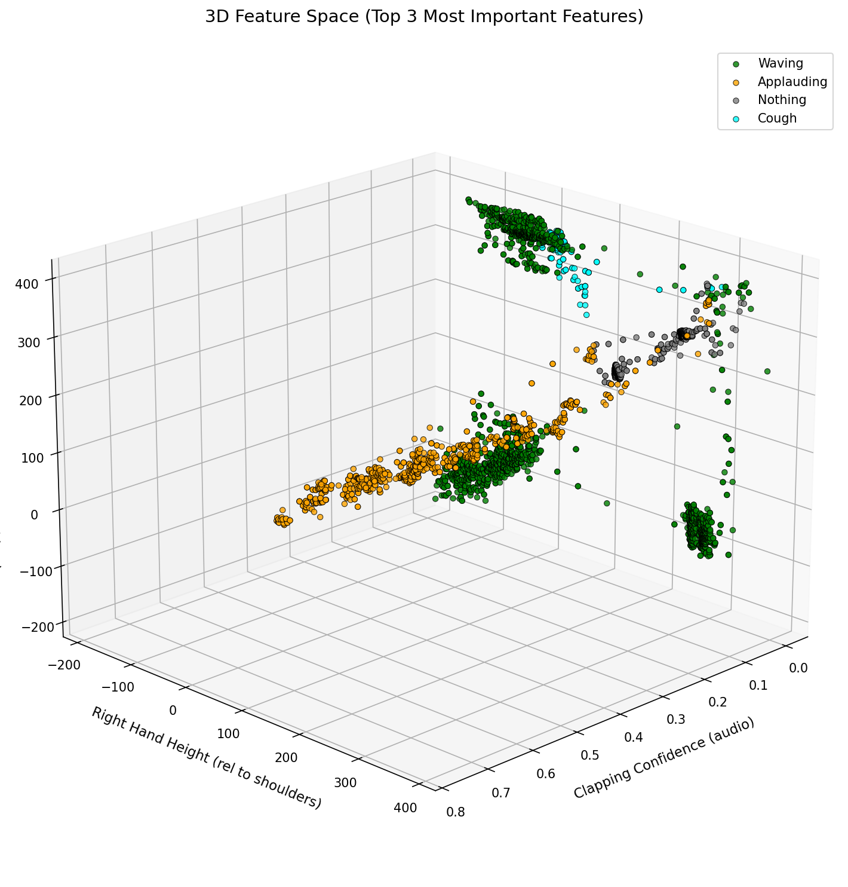

# Gesture Detection - A Basic Example Using PyTorch and Scikit-Learn

A real-time gesture detection system that uses YOLO pose estimation and decision tree classification to recognize hand gestures. I hacked this together on an afternoon (with ample help of Claude 4.5). At the end of the video below I show a failure mode. 

## Demo


## Features

The system detects three gesture classes:
- **Waving**: Hand moving side to side
- **Applauding**: Both hands moving together (clapping motion)
- **Nothing**: Still hands

## How It Works

1. **Pose Estimation**: Uses YOLOv8n-pose to detect body keypoints (wrists and shoulders)
2. **Feature Extraction**: Extracts 4 features from keypoints:
   - Left hand velocity
   - Right hand velocity
   - Left hand height relative to shoulders
   - Right hand height relative to shoulders
3. **Classification**: Decision tree classifier (max_depth=3) predicts the gesture

## Installation

```bash
pip install torch ultralytics opencv-python scikit-learn numpy matplotlib
```

## Usage

### Training Mode

Collect training data for each gesture:

```bash
python main.py
# Select mode: 1
```

Controls:
- Press `w` to record WAVING gestures
- Press `a` to record APPLAUDING gestures
- Press `n` to record NOTHING gestures (still hands)
- Press `SPACE` to pause/resume recording
- Press `s` to save the trained model
- Press `q` to quit without saving

### Inference Mode

Run real-time gesture detection:

```bash
python main.py
# Select mode: 2
```

Press `q` to quit.

### Visualization

Visualize the feature space and decision boundaries:

```bash
python visualize_features.py
```

### Feature Space Visualization


*2D Feature Space showing the distribution of training samples across velocity and height features. As you can see, our features could be improved a lot, as the velocity features seem to be unused. Note that improving our pose estimation as well as the framerate could definitely help here.*


*3D Feature Space displaying the top 3 most important features with decision boundaries, revealing how the classifier separates different gestures.*

## Model Architecture

- **Pose Estimator**: YOLOv8n-pose
- **Classifier**: Decision Tree (max_depth=3, min_samples_split=10, min_samples_leaf=5)
- **Features**: 4 (velocities + relative heights)
- **Classes**: 3 (waving, applauding, nothing)

## Performance

- Real-time performance on webcam (20+ FPS on Nvidia 3060GTX GPU)
- Lightweight decision tree ensures fast inference
- 80/20 train/test split with stratified sampling

## Requirements

- Python 3.8+
- Webcam
- CUDA-compatible GPU (optional, for faster inference)
